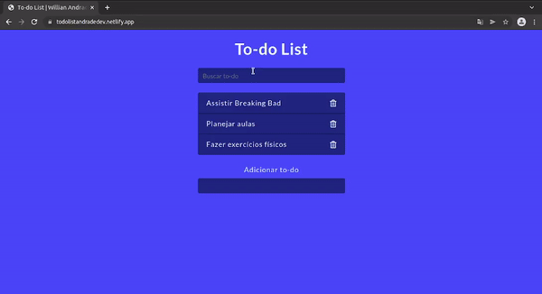

<h1 align="center" id="top">
  Simple To-do List 📝
</h1>

<p align="center">
  
</p>

## 🔧 Technologies

This project was developed using the following technologies:

**- JavaScript**

**- HTML5** 

**- CSS3**

**- Bootstrap 4**

And hosted using:

**- [Netlify](https://www.netlify.com/)**

## 💻 Getting Started

You can tweak as much as you like on your own by simply cloning the project to your machine:

```bash
$ git clone https://github.com/Will-Andrade/todoListCJRM.git
```

## 📚 Project

I made this project during the CJRM - Curso de JavaScript Roger Melo course, to practice DOM interactions, array methods (map, filter), and much more.

## ✍️ What I've Learned

1. How to use data- attributes with HTML and JavaScript to interact with the DOM.
2. Deep understanding of .map() and .filter() array methods.
3. Better refactoring and variables/functions naming.


<p align="center">Made with :heart: and Hard Work by <a href="https://github.com/Will-Andrade" target="_blank">Willian Andrade</a></p>
